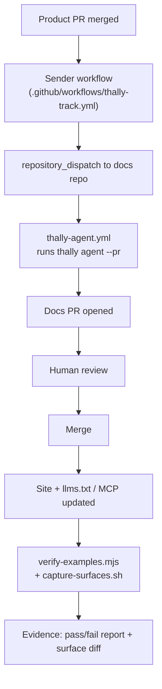

# thally-docsync

GitLite is a fork of Gitea, an existing open-source project. What this project built is the documentation system and the Thally Track integration that detects product changes and opens evidence-backed docs PRs.

This is a small, dependency-free kit (Node 20+ stdlib, bash) that makes that integration easy to attach to **any** GitHub product repo + Thally docs repo, and adds the verification pieces Thally's `track` command does not provide: running the docs site's own code samples against a live server, and capturing the agent-facing surfaces (llms.txt, MCP tool responses) as before/after evidence.

It does not reimplement Thally Track — `thally track add` / `thally track setup` do the actual wiring; this kit drives them and adds the missing verification layer.

## Flow



## What's in here

| File | Purpose |
| --- | --- |
| `bin/attach.sh` | Wires Thally Track onto a product+docs repo pair: runs `thally track add` / `thally track setup --write`, prints the sender workflow path and the two secrets you must add by hand. |
| `bin/verify-examples.mjs` | Runs every `bash`/`js` code sample in the docs site against a live product server; fails CI if any regress. Config via `docsync.config.json`. |
| `lib/examples.mjs` | Pure logic behind the verifier (block extraction, skip rules, curl `-w` rewriting, pass/fail decision) — unit tested, no I/O. |
| `bin/capture-surfaces.sh` | Snapshots the agent-facing surfaces of a docs site (`llms.txt`, `authentication.md`, `pagination.md`, agent-readiness score, MCP `search_docs`/`read_page` calls) for before/after diffing. |
| `action.yml` | Composite GitHub Action wrapping `verify-examples.mjs` for docs-repo CI. |
| `test/examples.test.mjs` | `node --test` coverage for `lib/examples.mjs`. |
| `examples/gitlite/` | Real output of `attach.sh` run against GitLite/gitlite-docs: the generated sender workflow and the `docs.json` tracking entry it produced. |
| `evidence/product/` | Copied from this project's own dry run: 49/49 example checks passing both before and after a real product change (see below). |

## Attach to any repo in 4 steps

1. Make sure the docs repo has the Thally CLI available (its own `.github/thally-tooling/node_modules/.bin/thally`, or `thally` on `PATH`) and an existing `.github/workflows/thally-agent.yml` (from `thally init` / `thally agent init`).
2. Run:
   ```bash
   bin/attach.sh <product-owner/repo> <path-to-docs-repo-checkout> \
     --paths "src/**,openapi.yaml" --branch main
   ```
3. Copy the printed `thally-track-sender-<repo>.yml` into the product repo as `.github/workflows/thally-track.yml`. `attach.sh` has already rewritten directory filters such as `'src/api'` to `'src/api/**'`; `thally track setup` emits bare directories, which GitHub's `paths` filter never matches.
4. Add the two secrets `attach.sh` prints:
   - **`ANTHROPIC_API_KEY`** in the **docs repo** — consumed by `thally-agent.yml` to run the docs agent (`dist/index.js:363`).
   - **`THALLY_DISPATCH_TOKEN`** in the **product repo** — a fine-grained personal access token scoped to the docs repo with **Contents: Read and write** (required by the `repository_dispatch` API), consumed by the sender workflow (`dist/index.js:569`).

   Then, in the docs repo, enable **Settings → Actions → General → Allow GitHub Actions to create and approve pull requests**, or add a `THALLY_AGENT_TOKEN` secret, so the agent can open its PR.

From there: merge a product PR → sender workflow dispatches → `thally-agent.yml` runs `thally agent ... --pr` → docs PR opens for human review.

Once the docs site is deployed, wire `bin/verify-examples.mjs` (directly, or via `action.yml`) and `bin/capture-surfaces.sh` into docs-repo CI to catch regressions the agent's own PR review might miss.

## Why example tests are not enough

`verify-examples.mjs` runs the docs site's `curl`/`fetch` samples against a live server and checks they still return 2xx (or an explicitly allowed status). That only proves the *examples still execute* — it says nothing about whether the *text around them* still matches reality. A field can be renamed, a default can change, a header can shift from `Authorization: token` to `Authorization: Bearer`, and every sample can keep passing because the code never asserts on prose.

That's exactly what happened in this project's own dry run: [`evidence/product/docs-examples-before.md`](evidence/product/docs-examples-before.md) and [`evidence/product/docs-examples-after-product-change.md`](evidence/product/docs-examples-after-product-change.md) both report **49/49 passed** — before and after a real product change that altered documented behavior (see [`evidence/product/feature-branch-curl.txt`](evidence/product/feature-branch-curl.txt)). The example suite alone was silent. Catching that kind of drift is what the Thally agent's PR-based doc rewrite (driven by the actual PR diff, not just by re-running samples) and `capture-surfaces.sh`'s surface snapshots are for — `verify-examples.mjs` is a regression net under that, not a replacement for it.

## Hackathon submission

Form answers, links, and disclosures: [SUBMISSION.md](SUBMISSION.md).

## Related repos

- Product: https://github.com/vaibhav700c/gitlite
- Docs: https://github.com/vaibhav700c/gitlite-docs

## Testing

```bash
node --test
bash -n bin/*.sh
node bin/verify-examples.mjs --help
```

No network access is required for any of the above; `verify-examples.mjs` only reaches out when pointed at a real running server.
